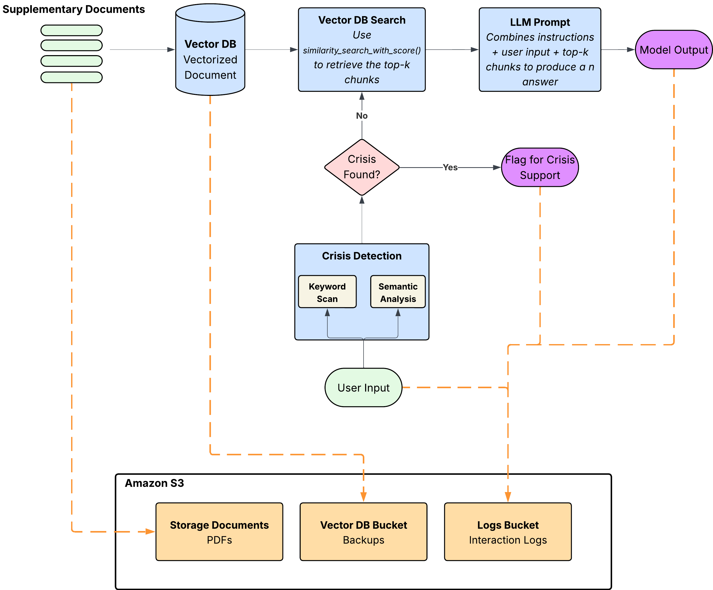

# CareCompass (CARE Bot) — Backend & Pipeline Summary

## System Diagram



## What It Is

A trauma-informed RAG (Retrieval-Augmented Generation) chatbot for sexual assault survivors. Users ask questions and get responses grounded in authoritative documents (SAMHSA trauma-informed care framework, CDC HIV/testing resources) with built-in crisis safety.

## Tech Stack

- **API**: FastAPI (Python), served via Uvicorn
- **LLM**: Google Gemini 2.5 Flash (via `google-genai` SDK)
- **Vector DB**: ChromaDB (persistent, local storage)
- **Embeddings**: `all-MiniLM-L6-v2` (384-dim, sentence-transformers) — runs locally
- **Crisis Detection ML Model**: `gooohjy/suicidal-electra` (HuggingFace, ELECTRA-based binary classifier)

## Document Ingestion Pipeline

1. **Source PDFs** placed in `data/raw/` (SAMHSA framework doc, CDC HIV brochures)
2. **PDF extraction** — page-by-page text extraction via `pypdf`
3. **Chunking** — 500-token chunks with 50-token overlap
4. **Metadata tagging** — each chunk gets `source`, `page`, `category`, `scenario_type`, `document_type`
5. **Embedding + storage** — ChromaDB's built-in `SentenceTransformerEmbeddingFunction` embeds chunks and stores them persistently at `data/processed/vectorstore/`

The vector store auto-initializes on first API startup if empty.

## Request Pipeline (per user message)

```
User query
  │
  ├─ 1. Crisis Detection (runs FIRST, before RAG)
  │     ├─ Layer 1: Keyword matching (~30 phrases for suicidal/self-harm language)
  │     └─ Layer 2: ML classifier (suicidal-electra, binary: LABEL_0/LABEL_1)
  │     → is_crisis = keyword_match OR model_triggered
  │
  ├─ 2. Retrieval
  │     ├─ Query embedded via all-MiniLM-L6-v2
  │     ├─ ChromaDB cosine similarity search (top-k=3, threshold=0.7)
  │     └─ Optional scenario filtering (e.g., "immediate_followup", "mental_health")
  │
  ├─ 3. Prompt Construction
  │     ├─ Trauma-informed system prompt (SAMHSA's 6 principles baked in)
  │     ├─ Retrieved document context injected
  │     └─ If crisis: crisis protocol instructions prepended
  │
  └─ 4. LLM Generation
        ├─ Google Gemini 2.5 Flash API call (temp=0.7, max 4096 tokens)
        ├─ Conversation history maintained (max 10 turns)
        └─ Fallback response with hotline numbers if API fails or safety filters block
```

## Crisis Safety Design

- Crisis detection runs **before** retrieval to ensure fast response
- Two layers: keyword matching catches explicit statements, ML model catches indirect/implicit expressions
- If crisis detected, LLM prompt gets crisis protocol instructions prepended (provide 988 Lifeline, Crisis Text Line, warm acknowledgment)
- If Gemini fails during a crisis, a hardcoded fallback with hotline numbers is returned
- ML model lazy-loads on first use to keep startup fast

## API Endpoints

| Endpoint | Method | Purpose |
|----------|--------|---------|
| `/chat` | POST | Main chat — takes `{query, scenario?}`, returns `{response, is_crisis, num_docs_retrieved, blocked}` |
| `/clear` | POST | Reset conversation history |
| `/health` | GET | Health check |
| `/stats` | GET | Vector store count, model info, history stats |
| `/categories` | GET | List of 5 scenario categories |

## Scenario Categories

Five predefined categories users can select to filter retrieval:

- **Medical Follow-Up** — STI/HIV testing, medical appointments, prophylaxis
- **Mental Health Support** — Counseling, anxiety, sleep issues, trauma support
- **Practical & Social Needs** — Housing, transportation, financial assistance
- **Legal & Advocacy** — Legal help, protection orders, reporting options
- **Delayed Follow-Up** — It's been a while, not sure if it still matters

## Key Config (tunable via `.env`)

| Parameter | Default |
|-----------|---------|
| `MODEL_NAME` | gemini-2.5-flash |
| `EMBEDDING_MODEL` | all-MiniLM-L6-v2 |
| `TOP_K` | 3 |
| `SIMILARITY_THRESHOLD` | 0.7 |
| `CHUNK_SIZE` | 500 |
| `CHUNK_OVERLAP` | 50 |
| `TEMPERATURE` | 0.7 |
| `MAX_OUTPUT_TOKENS` | 4096 |
